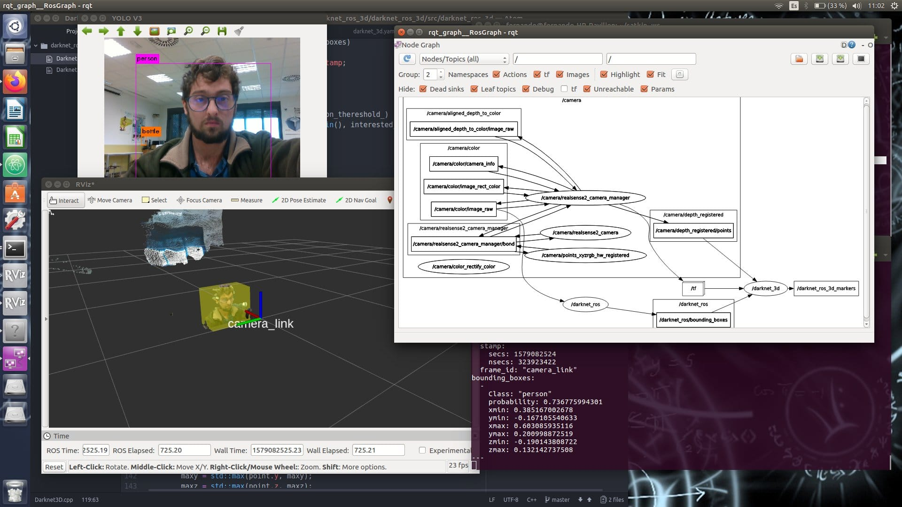

# Programación de Robots con ROS

ROS (Robot Operating System) es el estándar actual en el área de la Robótica. Tanto es así que es esencial en la investigación en esta área, y un requisito imprescindible para acceder al cualquier puesto laboral relacionado con la Robótica.

  

# Programación de Robots con ROS2

Con el lanzamiento de ROS2, se plantea un nuevo sistema con características mucho más avanzadas y será el nuevo estándar en el desarrollo de software robótico en la industria.

  

# Navegación de Robots con ROS y ROS2

La pila de navegación ROS / ROS2 es uno de sus paquetes principales y permite dotar a un robot de capacidades básicas de movimiento de forma sencilla.

  

# Percepción de Robots con ROS y ROS2

Los sensores son una fuente de datos muy importante para los robots. Gracias a ellos, pueden reconocer su entorno y obtener información muy valiosa sobre él.

  

# Aplicación de Deep Learning en Robots usando ROS/ROS2

El Deep Learning es una de las áreas más populares en el campo de la robótica. Las investigaciones en esta área han obtenido resultados asombrosos en campos como Procesamiento del lenguaje natural y Visión por computadora

  
